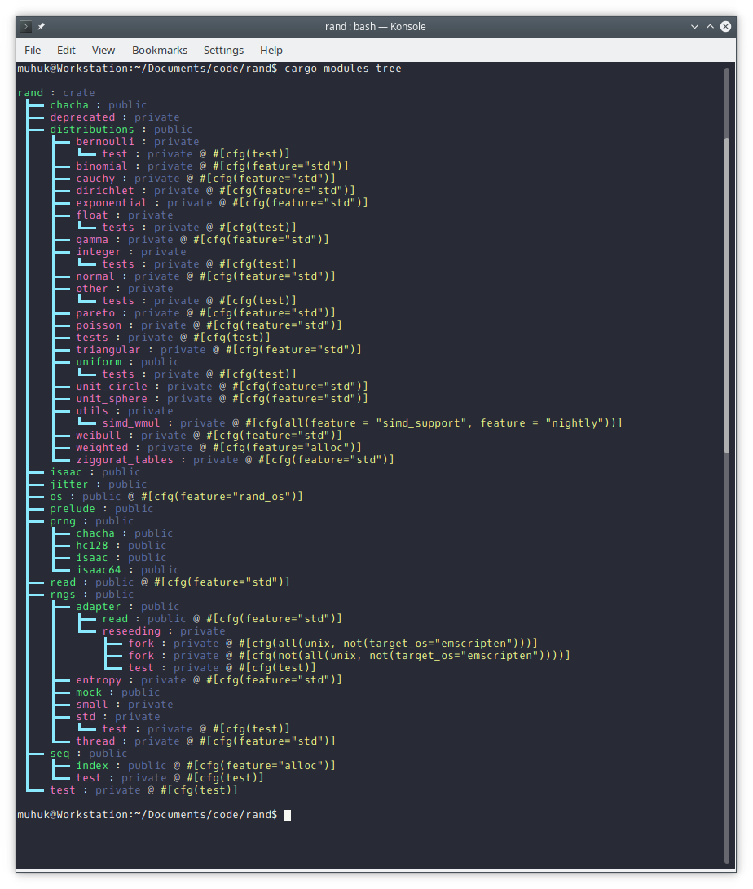
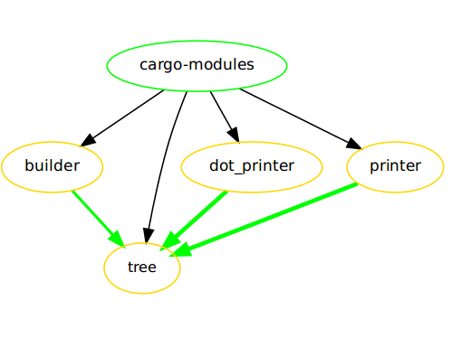

# cargo-modules

[](https://travis-ci.org/regexident/cargo-modules)
[](https://crates.io/crates/cargo-modules/)
[](https://crates.io/crates/cargo-modules/)
[](https://crates.io/crates/cargo-modules/)

## Synopsis

A cargo plugin for showing an overview of a crate's modules.

## Motivation

With time, as your Rust projects grow bigger and bigger,
it gets more and more important to properly structure your code.
Fortunately Rust provides us with a quite sophisticated module system,
allowing us to neatly split up our crates into arbitrarily small sub-modules
of types and functions. While this helps to avoid monolithic and unstructured
chunks of code, it can also make it hard at times to still mentally stay
on top of the over-all high-level structure of the project at hand.

This is where `cargo-modules` comes into play:



## Installation

Install `cargo-modules` on nightly via:

```bash
cargo install cargo-modules
```

Or using rustup's ad-hoc mode:

```bash
rustup run nightly cargo install cargo-modules
```

Or if you want to build it locally:

```bash
$ rustup run nightly cargo build --release
```

## Usage

**cargo-modules requires nightly to run.**
As such unless you already are using `nightly` you need to either run this [rustup](https://github.com/rust-lang-nursery/rustup.rs#toolchain-override-shorthand) command _once_,
to set the default toolchain to `nightly`:

```bash
rustup default nightly
```

… or override the toolchain for the current directory (again, _once_):

```bash
rustup override set nightly
```

To then be able to just call **cargo-modules** through:

```bash
cargo modules <options>
```

Or if you want to stay on the `beta` or `stable` toolchain you would have to call **cargo-modules** through:

```bash
rustup run nightly cargo modules <options>
```

### Tree mode

Display module parent-child relationships as a tree:


``` bash
cargo modules tree
```

### Graph mode

If you also want to see which modules depends on which other modules, you can use graph mode to output Graphviz DOT compatible output:

```bash
cargo modules graph
```



As extra options you can toggle external types/modules, conditional modules and used types using the `--external`, `--conditional` and `--types` options respectively.

You can convert the output to a PNG file as below:

``` bash
cargo modules graph | dot -Tpng > modules.png
```

#### Legend

- Green nodes are public modules.
- Yellow nodes are private modules.
- Black nodes are external types or modules.
- Dotted nodes are conditional (test modules for example).

- Black edges denote a 'is sub module of' relation.
- Yellow/Green edges denote a 'use something of module' relation  
  The width of the edge is determined by the number of types used.
  If types are enabled the edge label shows the types used
  Green means the use is public, yellow means the use is private.

### Orphaned Modules

If you want to also list of potentially orphaned modules,
then add a `--orphans` argument:

```bash
cargo modules --orphans tree

cargo modules --orphans graph
```

Any file `src/../foo.rs` or `src/../foo/mod.rs` that is not linked by its
`super`-module via `mod foo;` is considered a (potential) orphaned module.

To keep false positives to a minimum `cargo-modules` excludes all build scripts
as well as `lib.rs` and `main.rs` from the selection of potential orphans.

### Monochrome Mode

cargo-modules checks for the presence of a `NO_COLOR` environment variable that, when present (regardless of its value), prevents the addition of ANSI color.

### Help

If you need any further help:

```bash
cargo modules --help
```

## Contributing

Please read [CONTRIBUTING.md](CONTRIBUTING.md) for details on our [code of conduct](https://www.rust-lang.org/conduct.html),  
and the process for submitting pull requests to us.

## Versioning

We use [SemVer](http://semver.org/) for versioning. For the versions available, see the [tags on this repository](https://github.com/regexident/cargo-modules/tags).

## License

This project is licensed under the [**MPL-2.0**](https://www.tldrlegal.com/l/mpl-2.0) – see the [LICENSE.md](LICENSE.md) file for details.
